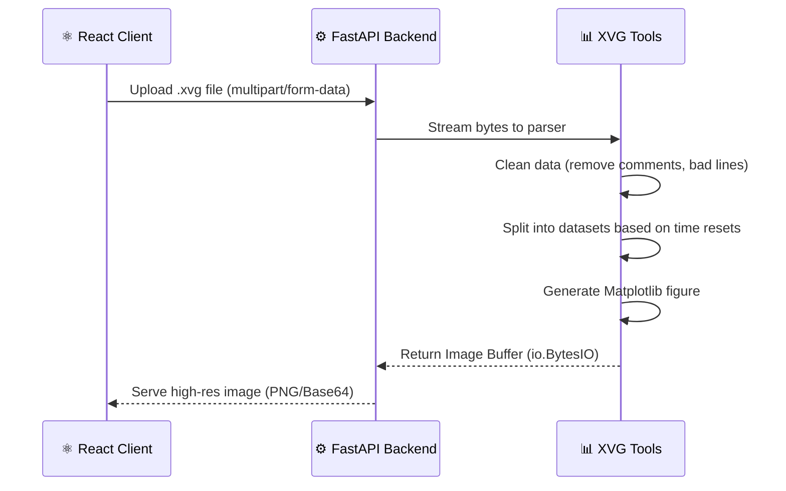

<div align="center">
  <h1>🚀 Rasul's Portfolio & Scientific Computation Suite</h1>
  
  <p>
    <b>A High-Performance Full-Stack Web Platform integrating Computational Biology Tools</b>
  </p>

  [](https://www.python.org)
  [](https://fastapi.tiangolo.com)
  [](https://reactjs.org/)
  [](https://www.docker.com/)
  [](#license)
</div>

---

## 📖 Project Overview

**Rasul's Portfolio** is an enterprise-grade, comprehensive full-stack web application designed to showcase advanced software engineering methodologies intertwined with computational biology tooling. Currently hosted at [https://rick-c137.tech/](https://rick-c137.tech/), the platform orchestrates a high-performance backend engineered for scientific data analysis, seamlessly coupled with a modern, highly responsive frontend.

This system highlights a dual expertise in web development and scientific computing, featuring:
- A sophisticated **Blogging Engine** designed for rich technical content delivery.
- A specialized **GROMACS Molecular Dynamics Analysis Suite** tailored for massive computational datasets.

---

## ✨ Key Characteristics

- **High-Performance Scientific Analysis**: Handles large GROMACS (`.xvg`) datasets using custom data parsing techniques.
- **Real-time Visualization Engine**: Dynamically generates high-resolution, presentation-ready plots directly from scientific data using backend-driven visualization logic.
- **Enterprise-Grade Security First**: Employs rigorous industry-standard security practices, including strict Input Sanitization, robust OAuth2 with JWT session management, resource usage throttling, and strictly configured CORS.
- **Modern Microservices Architecture**: Completely decoupled frontend and backend services, containerized via Docker for maximum scalability and deployment reliability.
- **Memory-Efficient Processing**: Intelligently handles data streaming and computational offloading, allowing for gigabyte-scale data processing on memory-constrained infrastructure.

---

## 🛠️ Technology Stack

| Component | Technologies & Frameworks | Description |
| :--- | :--- | :--- |
| **Frontend** | React, Vite, TypeScript, TailwindCSS, Recharts | Component-based, modern SPA architecture ensuring responsive, fluid user experiences. |
| **Backend** | Python 3.12+, FastAPI, Pandas, Matplotlib, SQLModel | Asynchronous, type-safe API with high-throughput scientific data analysis capabilities. |
| **Infrastructure** | Docker, Docker Compose, Nginx | Fully containerized environments with reverse proxying and SSL termination capabilities. |
| **Data Store** | Persistent SQLite / Relational DB | Handled via abstract ORM (SQLModel) allowing seamless database engine swapping. |

---

## 🏗️ Architecture & Data Flow

The platform employs a robust microservices architecture orchestrated via Docker. This guarantees deep isolation, heightened security, and scalable infrastructure.

### System Architecture
```mermaid
graph TD
    User([User / Browser]) -->|HTTPS / WSS| Nginx[Nginx Reverse Proxy]
    
    subgraph "Containerized Microservices"
        Nginx -->|/api/*| Backend[FastAPI Backend]
        Nginx -->|/*| Frontend[React Client]
        
        Backend -->|Read / Write| DB[(Persistent DB Storage)]
        Backend -->|Stream / Process| Volume[Data Volume (Uploads)]
    end
    
    style User fill:#f9f9f9,stroke:#333,stroke-width:2px
    style Nginx fill:#e0f2fe,stroke:#0284c7,stroke-width:2px
    style Backend fill:#dcfce7,stroke:#16a34a,stroke-width:2px
    style Frontend fill:#f3e8ff,stroke:#9333ea,stroke-width:2px
    style DB fill:#fef08a,stroke:#ca8a04,stroke-width:2px
    style Volume fill:#ffedd5,stroke:#ea580c,stroke-width:2px

```

### XVG Processing Data Flow


---

## 🔬 XVG Analysis Tool

The GROMACS XVG Analysis Tool is a cornerstone feature of the platform, built to ingest, clean, and visualize scientific data with high fidelity.

### How It Works
Based on the underlying `xvg_tools.py` engine, the tool operates through the following steps:
1. **Intelligent Ingestion**: Accepts raw byte streams directly from API endpoints without requiring complete disk-writes, reducing latency.
2. **Data Cleaning & Normalization**: Utilizes `pandas` to forcefully bypass bad lines, remove comment headers (e.g., lines starting with `@` or `#`), and coerce the dataset into strict numeric representations.
3. **Trajectory Splitting**: Automatically calculates time differentials. If the tool detects a negative time delta (time reset), it smartly splits the dataframe into distinct continuous datasets (trajectories) to avoid "spaghetti" plotting.
4. **Dynamic Rendering**: Employs a non-interactive `matplotlib` backend (`Agg`) to securely construct highly customizable plots (colors, steps, boundaries, grids) and returns a binary image buffer.

---

## 🚀 How to Run (Local Deployment)

The system is fully encapsulated within Docker, requiring only `docker-compose` to spin up the entire architecture locally.

### Prerequisites
- [Docker Engine](https://docs.docker.com/engine/install/)
- [Docker Compose](https://docs.docker.com/compose/install/)

### Step-by-Step Instructions

1. **Clone the Repository**
   ```bash
   git clone <repository_url>
   cd <repository_directory>
   ```

2. **Configure Environment Variables**
   Ensure that the required variables are set, or use the default fallbacks provided in the `docker-compose.yml`. Key variables include:
   - `ALLOWED_ORIGINS`
   - `BASE_URL`
   - `API_URL`
   
3. **Build and Spin Up the Containers**
   ```bash
   docker-compose up --build -d
   ```
   *The `-d` flag runs the containers in detached mode.*

4. **Access the Platform**
   - **Frontend UI**: `http://localhost:<mapped_port>` (or defined `BASE_URL`)
   - **Backend API Docs**: `http://localhost:<mapped_api_port>/docs`

5. **Stopping the Containers**
   ```bash
   docker-compose down
   ```

---

## 🔒 Operational Security

The platform is engineered with **"Security by Design"** principles:
- **Input Sanitization**: All file uploads (`.xvg`) and user inputs are strictly validated.
- **Resource Limits**: Configured to handle streaming uploads and offload processing queues, effectively mitigating Denial of Service (DoS) risks associated with resource exhaustion.
- **Strict CORS**: Cross-Origin Resource Sharing is tightly bound only to trusted, designated domains.

---

## 📜 License

All rights reserved. Content and code are proprietary to Rasul's Portfolio.
