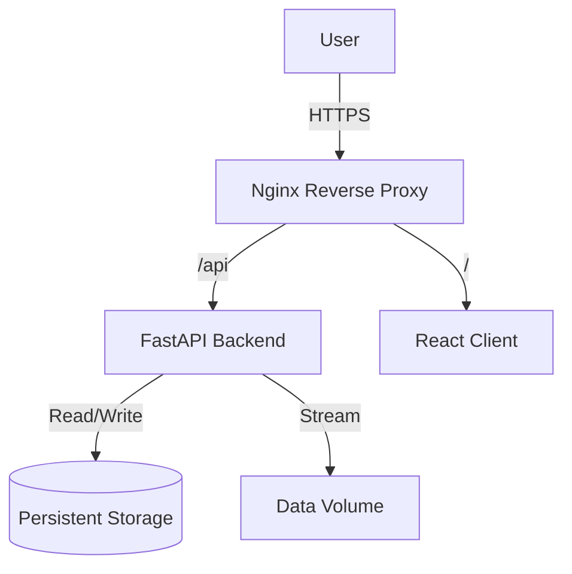

# Rasul's Portfolio

## Project Overview
Rasul's Portfolio is a comprehensive, full-stack web platform designed to showcase advanced software engineering capabilities and computational biology tools. Hosted at [https://rick-c137.tech/](https://rick-c137.tech/), it integrates a high-performance backend for scientific data analysis with a modern, responsive frontend.

The system features a robust blogging engine for technical content and a specialized analysis suite for GROMACS molecular dynamics data, demonstrating expertise in both web development and scientific computing.

## Architecture

The application employs a microservices-based architecture orchestrated via Docker, ensuring scalability and isolation.

## Key Features

### 1. High-Performance Scientific Analysis
*   **Memory-Efficient Processing**: Includes a custom streaming parser for massive GROMACS (.xvg) files. The algorithm achieves O(1) memory usage, enabling the processing of gigabyte-scale datasets on constrained environments with minimal RAM footprint.
*   **Real-time Visualization**: Generates high-resolution plots dynamically using backend-driven visualization engines.

### 2. Secure Content Management
*   **Professional Blog Engine**: A custom-built CMS allows for the creation and management of technical articles with Markdown support.
*   **Security First**: Implements industry-standard security practices, including OAuth2 with JWT (JSON Web Tokens) for session management and strict password hashing protocols.

### 3. Modern Tech Stack
*   **Frontend**: Built with React and Vite, utilizing a component-based architecture for a responsive and interactive user experience.
*   **Backend**: Powered by FastAPI (Python 3.12+), leveraging asynchronous I/O for high throughput and SQLModel for type-safe database interactions.
*   **Infrastructure**: Fully containerized using Docker, with Nginx serving as the reverse proxy and SSL termination point.

## Deployment & Configuration

The system is designed for production deployment using container orchestration. It requires a configured environment to ensure secure and correct operation.

### Environment Configuration

The application relies on environment variables for configuration. These should be defined in the deployment environment or orchestration files:

*   `API_URL`: The public endpoint of the backend API (e.g., `https://api.rick-c137.tech`).
*   `BASE_URL`: The base URL used for constructing internal resource links.
*   `ALLOWED_ORIGINS`: A strict list of origins permitted to access the API via CORS (e.g., `https://rick-c137.tech`).
*   `SECRET_KEY`: A high-entropy cryptographic key used for signing authentication tokens. **Must be kept private.**
*   `DATABASE_URL`: Connection string for the persistent data store.

### Operational Security

The platform is engineered with "Security by Design" principles:
*   **Input Sanitization**: All file uploads and user inputs are strictly validated and sanitized to prevent injection attacks.
*   **Resource Limits**: Streaming uploads and background processing queues prevent Denial of Service (DoS) via resource exhaustion.
*   **Strict CORS**: Cross-Origin Resource Sharing is configured to allow only trusted domains.

## License

All rights reserved. content and code are proprietary to Rasul's Portfolio.
